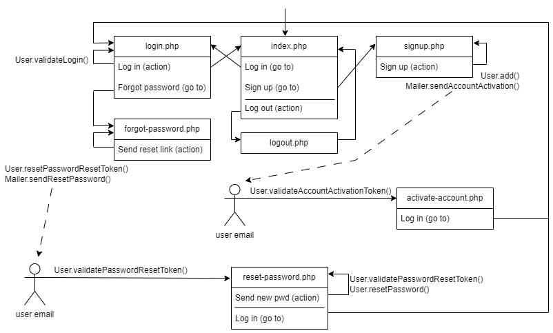

# Sign up and login
Sample implementation of sign up with email activation, login and password reset via email confirmation in PHP.
It uses the [PHPMailer](https://github.com/PHPMailer/PHPMailer) library to send emails and [SendMail](https://www.mailersend.com/) as SMTP server.

## Code diagram


## Class diagram


## Installation
A `.env` file must be created in the root folder with the following values:
```
APP_BASE_URL=<your_application_base_url>
MAILER_HOST=<your_smtp_provider_host_address>
MAILER_PORT=<your_smtp_provider_port>
MAILER_USERNAME=<your_smtp_provider_username>
MAILER_PASSWORD=<your_smtp_provider_password>
```

## Tools
PHPMailer / PHP8 / Water.css / CSS3 / HTML5

## Author
Arturo Mora-Rioja, based on the course <em>[PHP Signup and Login](https://www.youtube.com/playlist?list=PLFbnPuoQkKsecy8YatFtdcQ2epiakgbrd)</em> by Dave Hollingworth.