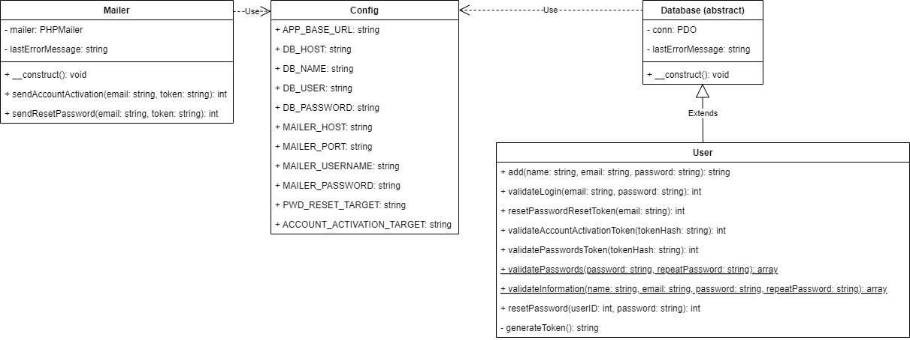

# Sign up and login
Sample implementation of sign up with email confirmation and login in PHP.
It uses the [PHPMailer](https://github.com/PHPMailer/PHPMailer) library to send emails and [SendMail](https://www.mailersend.com/) as SMTP server.

## Code diagram

## Class diagram

## Installation
`Config::APP_BASE_URL` must be updated to the base URL where the application runs.

## Tools
PHPMailer / PHP8 / Water.css / CSS3 / HTML5

## Author
Arturo Mora-Rioja, based on the course <em>[PHP Signup and Login](https://www.youtube.com/playlist?list=PLFbnPuoQkKsecy8YatFtdcQ2epiakgbrd)</em> by Dave Hollingworth.